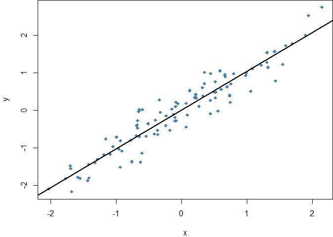

GitTestMarkdown
================
Navaak
2022-04-30

## Title

This is the main description text, the code and the plot follow.

``` r
x <- rnorm(100)
y <- x + rnorm(100, 0, .3)
par(mar=c(4, 4, 0, 0))
plot(x, y, pch = 18, col = 'steelblue')
abline(lm(y ~ x), lwd = 2)
```

<!-- -->
