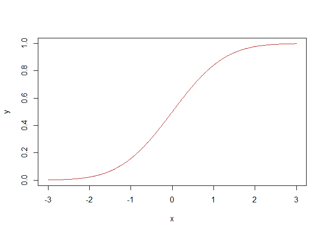

This new Script was not initially created with Markdown
================
Navaak
2022-04-30

This comment should show up in the text. And it is still, just a
comment. Nothing fancy going on. The same applies to this text over
here.

``` r
x <- seq(-3, 3, by = .01)
y <- pnorm(x)
plot(x, y, type = 'l', col = 'firebrick')
```

<!-- -->

And finally, this comment should be visible as well.
